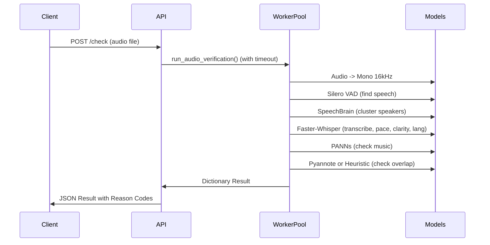

# Voice/Audio Verification API Documentation

## 1. Request / Response Contract

### 1.1 `POST /api/v1/audio-verify/check`
Verifies a single voice recording against the full checklist.

**Request:** `multipart/form-data`
- `file` (file, required): Audio bytes (wav, mp3, m4a, ogg, flac)
- `session_id` (string, optional): Correlation ID.
- `strict_tone_check` (bool, optional): If `true`, fails the file if it's too monotone or has abrupt pitch shifts. Default `false`.

**Response (200 OK):**
```json
{
  "passed": false,
  "confidence": 0.88,
  "duration_seconds": 10.5,
  "languages_detected": ["en"],
  "primary_reason": {
    "code": "BACKGROUND_MUSIC_DETECTED",
    "message": "Background music detected. Please provide a voice-only recording with no music."
  },
  "checks": {
    "silence_presence": { "passed": true, "score": 0.95 },
    "noise": { "passed": true, "score": 25.4, "unit": "dB_SNR" },
    "loudness_clipping": { "passed": true, "lufs": -20.1, "clipping_ratio": 0.0 },
    "background_music": { "passed": false, "score": 0.42 },
    "overlapping_voices": { "passed": true, "overlap_seconds": 0.0, "heuristic_fallback_used": false },
    "multiple_speakers": { "passed": true, "num_clusters": 1, "cluster_shares": [1.0] },
    "speech_clarity": { "passed": true, "avg_confidence": 0.88 },
    "speech_pace": { "passed": true, "words_per_minute": 135 },
    "tone_consistency": { "passed": true, "advisory": true }
  },
  "processed_in_ms": 1250
}
```
*Note on Confidence:* Top-level `confidence` mirrors the `avg_confidence` from the `speech_clarity` (Whisper avg_logprob) check as a general indicator of acoustic intelligibility.

### 1.2 `POST /api/v1/audio-verify/check-batch`
Verifies multiple takes for the same project. All must pass individually, AND the speaker must be consistent across all files.

**Request:** `multipart/form-data`
- `files` (array of files): The audio files to test.
- `session_id`, `strict_tone_check`: Same as above.

**Response (200 OK):**
```json
{
  "session_id": "abc123",
  "overall_passed": false,
  "results": {
    "take_1.wav": { "...same shape as /check..." },
    "take_2.wav": { "...same shape as /check..." }
  },
  "speaker_consistency": {
    "passed": false,
    "reason_code": "SPEAKER_MISMATCH_ACROSS_FILES",
    "pairwise_distance": {
      "take_1.wav_take_2.wav": 0.85
    }
  },
  "processed_in_ms": 3400
}
```
*(Cosine distance is used: 0.0 is identical, > 0.70 is typically a mismatch).*

## 2. Reason Codes Reference
- `UNSUPPORTED_FORMAT`: File is not wav, mp3, m4a, ogg, or flac.
- `FILE_TOO_LARGE`: > 25MB.
- `CORRUPT_AUDIO`: Unreadable.
- `DURATION_TOO_SHORT` / `DURATION_TOO_LONG`: Outside 3s-600s range.
- `SILENCE_ONLY` / `INSUFFICIENT_SPEECH`: Not enough speech detected (Silero VAD).
- `NOISY_AUDIO`: SNR below 15dB.
- `LOW_VOLUME`: LUFS below -35.
- `AUDIO_CLIPPING_DETECTED`: Hard digital clipping.
- `BACKGROUND_MUSIC_DETECTED`: PANNs detected music.
- `OVERLAPPING_VOICES_DETECTED`: Two voices talking over each other.
- `MULTIPLE_SPEAKERS_DETECTED`: More than one voice identity found (SpeechBrain clustering).
- `SPEECH_UNCLEAR`: Whisper avg_logprob is very low.
- `SPEECH_TOO_SLOW` / `SPEECH_TOO_FAST`: WPM out of bounds.
- `TONE_INCONSISTENT`: Very flat/monotone delivery OR abrupt pitch splice detected.
- `SPEAKER_MISMATCH_ACROSS_FILES`: ECAPA-TDNN distance between takes is too large.

## 3. Configuration & Thresholds
Most logic relies on `app/verification/constants.py` and `.env`:
- `HF_TOKEN`: Pyannote model auth.
- `WORKER_POOL_SIZE=2`: Number of parallel heavy-model worker processes.
- `REQUEST_TIMEOUT_SECONDS=25`: Fails the request with `408 Request Timeout` if verification exceeds this time.
- **Threshold Calibration:** Thresholds in `constants.py` act as starting points. **Calibration is strongly recommended** against real samples, particularly for SNR, Pyannote overlap tolerance, and Pace. Pace and Clarity defaults are tuned for English/Hindi generically and may need per-language tweaks.

## 4. Known Limitations & Setup
- **Pyannote Overlap Model:** Requires accepting terms of use on Hugging Face at `pyannote/overlapped-speech-detection`. 
  - **Failure Mode:** If you do not provide `HF_TOKEN`, the API will log a warning at startup and silently fall back to a built-in spectral polyphony heuristic. It will not crash at runtime. The fallback is functional but less accurate than Pyannote.
- **Tone Consistency:** Kept soft by default, as accurate pitch tracking can falsely flag highly expressive speaking.
- **System Dependencies:** You must install `ffmpeg` and `libsndfile1` (or Windows equivalents) for audio processing to work reliably. 

## 5. Security, Privacy, and Architecture

- **Data Privacy & Retention:** This API processes all biometric and audio data **strictly in memory**. Audio segments and extracted embeddings (ECAPA-TDNN) are *never* written to a persistent database or logged. For `pyannote` inference, a temporary `.wav` file is created and strictly deleted within a `finally` block in the same function scope.
- **Node.js Reverse Proxy Architecture:** This is an internal, heavy-lifting microservice. It deliberately omits authentication, rate-limiting, and large-file upload protections under the strict architectural requirement that it sits behind a **Node.js API Gateway**. The Node.js server is responsible for rejecting massive "Zip Bomb" payloads (>10MB) and managing request queues to prevent Python ProcessPool memory exhaustion.
- **VAD Algorithmic Gating (Anti-Hallucination):** To prevent Faster-Whisper from hallucinating text on static noise (a known mathematical flaw), the pipeline utilizes a strict Voice Activity Detection (VAD) gate. If the `silence_presence` check fails (due to lack of speech frames), the pipeline instantly rejects the file and physically prevents Whisper from executing.
- **Startup Warmup:** Upon startup, the worker pool automatically runs a dummy inference cycle through all ML models to force memory allocation. The `/health` endpoint only reports readiness once this warmup completes, guaranteeing the first real request is fully accelerated.
- **Docker Deployment:** For detailed information on how the API bakes AI models into the Docker image and completely disables C-level CPU thrashing (via `OMP_NUM_THREADS`), please read [5_docker_deployment.md](docs/5_docker_deployment.md).

## 6. Sequence Diagram


